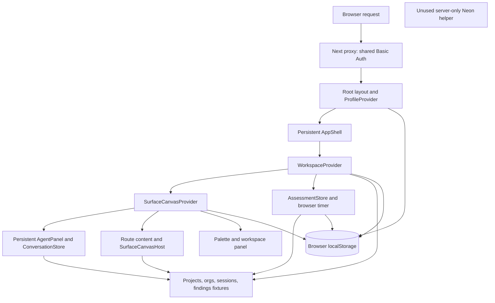
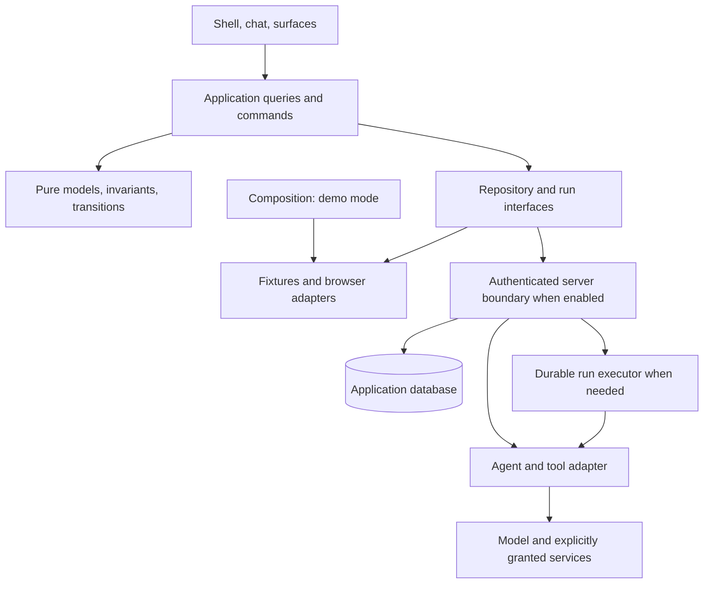

# Architecture review

**Reviewed:** September 15, 2026 · commit `4e52aa1`  
**Purpose:** Keep the prototype dependable locally and on Heroku, and make it a sound foundation for a real agent and application if the concept progresses.

## Executive assessment

**Keep the application and its interaction model. Refactor the ownership and integration boundaries before adding a real agent.** The existing shell, serializable canvas specifications, domain helpers, and focused tests are useful foundations. A wholesale rewrite is not justified by this review.

The main architectural weakness is that demo assumptions have become application contracts: a workspace always has a project, worktree, and connected org; finding definitions are also historical evidence; the selected UI context can determine a draft's meaning; and agent behavior lives inside a rendering component. Those assumptions make the simulation easy to build but would make a real integration harder to reason about.

The code is currently a browser application with simulated workflows, served by Next.js behind a shared password. The database helper is unused. That is consistent with the current product stage. Adding a real agent will require more than replacing canned text with a model call: it needs explicit input context, operation ownership, typed results, and a boundary for tools and credentials.

### Highest-value work now

1. Fix browser persistence failures and stop treating changes in org availability or fixture definitions as reasons to discard saved plans.
2. Define who owns project, worktree, org, canvas, and conversation context; make navigation use one explicit application command.
3. Extract simulated assessment and agent behavior behind small interfaces that can later accept real implementations.
4. Retire or deliberately migrate the substantial unused canvas implementation, leaving one documented extension path.
5. Make the existing checks gate Heroku deployment, then add a small set of browser checks for the shell and keyboard interactions.

**Stage for real integration:** authenticated server access, durable application records, and background execution when operations need to survive disconnection or restart. The present prototype does not need a speculative multi-service platform.

## Review method and evidence

Three independent agents reviewed domain/state contracts, frontend architecture, and production/security/release concerns. The primary reviewer mapped dependencies, traced shared flows, ran the existing checks, reproduced store failures, and reconciled findings. In particular, a suspected blanket project-selection bug was withdrawn after the palette's Overview reset was identified; the remaining navigation concern is architectural, with a possible cross-route race still unverified.

The review covered the tracked application, models, stores, UI modules, configuration, deployment workflow, test scripts, and existing animation documentation. Static reachability was computed from App Router entry files and `src/proxy.ts`, following local imports, including type imports and imported CSS. Files outside that graph were inspected as dormant implementation, not counted as active runtime behavior.

| Check | Result |
| --- | --- |
| Locked dependency install | `npm ci` succeeded; lockfile unchanged |
| Conversation suite | 9/9 passed |
| Onboarding suite | 9/9 passed |
| Lint | 0 errors; 1 existing manual-stylesheet warning in `src/app/layout.tsx:36` |
| Production build and TypeScript | Passed; current application routes prerendered successfully |
| Storage transition probes | Confirmed workspace/tab state resets after storage reads begin throwing |
| Historical-data probes | Confirmed saved project disappears from parsed state after target connection expiry or referenced finding removal |
| Canvas identity probe | Confirmed distinct parameter records can generate the same ID |
| Subscription probe | A separate store observer received no notification of another instance's write; explicit read saw the update |

Checks ran on this machine's **Node 24.18.0**; the project declares **Node 22.x**. This is evidence of a successful local build, not verification on the declared deployment runtime. A temporary isolated TypeScript harness ran the additional probes; fixture changes occurred only in that harness's memory. No application code was changed.

No fresh browser automation, live Heroku inspection, load test, external service integration, dependency vulnerability audit, or branch-protection inspection was performed. Browser findings below are source-traced unless stated otherwise. Existing performance measurements in `docs/animation-performance.md` are prior evidence, not measurements repeated during this review.

## Current architecture



| Concern | Current authority | Architectural consequence |
| --- | --- | --- |
| Site access | Shared environment password in proxy | Adequate as the documented demo gate; no individual application identity |
| Demo persona | Browser profile store | Product scenario selection, not a security principal |
| Workspace context | Selection store plus provider fallbacks and active-tab effect | Several writers influence what “current work” means |
| Projects and plans | Fixtures or browser assessment blob | Project behavior differs by persona/onboarding path |
| Assessment | Fixture catalog plus browser interval | No separately identified run or durable executor |
| Canvases and drafts | Per-profile, per-surface browser blob | Good serializable view model; scope and durability are underspecified |
| Conversation | Mounted `AgentPanel` store | Survives client navigation; lost on remount/reload |
| Deployment | Heroku source build workflow | Build status is checked; running-app health is not |

## Findings

Timing labels reflect the clarified goal: **Now** means worthwhile while remaining a prototype; **Integration gate** means required when the corresponding real feature is introduced; **Growth** means defer implementation until usage gives it a concrete need.

### F1. Browser persistence can lose the active state and misreport saving

**Timing: Now · Confirmed defect.**

Both the workspace and canvas stores convert a failed storage read into `null`, then replace a previously populated cache with initial state. The implementation confuses “storage is unavailable” with “no saved value exists.” Assessment and profile stores already use a different, memory-preserving fallback. See [workspace persistence](../src/lib/workspace/persistence.ts#L98), [canvas persistence](../src/lib/surface-canvas/persistence.ts#L145), and [assessment persistence](../src/lib/onboarding/persistence.ts#L102).

**Reproduction:** save a selected project and open a canvas with functioning storage; make subsequent `getItem` calls throw; read the stores again. The project changes from `saved-project` to `null`, and open canvases change from one to zero. This probe demonstrates a reset of the current in-memory view; it does not establish that the previously stored browser bytes were deleted.

The draft UI reports “Draft saved locally” based on nonempty fields, with no acknowledgement from storage ([CapabilityDraftCanvas](../src/components/surfaces/CapabilityDraftCanvas.tsx#L64), line 122). A failed write can therefore still produce a success claim.

There is also no `storage` event subscription connecting other browser tabs to these stores. A fresh read can see another writer's value, but subscribers are not notified when it changes. The probe confirmed that distinction; it did not establish a concurrent lost-write scenario. React's external-store contract requires notifications when the source changes. [React documentation](https://react.dev/reference/react/useSyncExternalStore).

**Smallest coherent fix:** a shared browser-storage adapter that distinguishes absent, invalid, unavailable, and saved data; retains the current cache on failure; exposes persistence status; and defines cross-tab synchronization. Keep each domain's parsing and commands separate. Use a versioned payload and migration policy so future changes do not silently strand data behind a new key.

**Acceptance:** cover working→blocked storage, write-only failures, blocked→recovered storage, malformed payloads, and two-tab notification. An in-memory edit remains editable and is not falsely reported as durable.

### F2. Saved projects depend on the current fixture catalog and connection state

**Timing: Now for historical semantics; Integration gate for durable storage · Confirmed conditional data-loss behavior.**

`parseAssessment()` validates saved projects against currently connected sandbox targets and currently available fixture findings. It drops invalid targets, removes work items whose findings no longer resolve, and drops projects left with no items. Even saved priority is reconstructed from the current finding. The project renderer reads evidence and implementation steps directly from that catalog. See [parser](../src/lib/onboarding/persistence.ts#L28), lines 41–63, and [project plan](../src/components/onboarding/ImprovementProject.tsx#L37), lines 44–53.

**Reproduction:** create a project with one finding and serialize it. In the isolated harness, expire its target connection; parsing now returns zero projects. Restore the connection and remove the referenced finding; parsing again returns zero projects. Today's fixture UI does not expose these catalog mutations, but a deployment editing fixtures or a real connection lifecycle would exercise the same dependency.

**Underlying problem:** deserialization, present-day permission checks, and historical record interpretation are doing one job together. A connection becoming unavailable should block future access or execution according to policy; it should not implicitly delete the application's project record. Likewise, a new scan should not rewrite what an old plan was based on.

**Smallest coherent fix:** separate `AssessmentRun`, immutable `FindingSnapshot`, `Project`, and temporary `ProjectDraft`. Save the evidence/plan version referenced at project creation. Parse historical records structurally, then resolve present access and availability separately. Handle unavailable references explicitly; apply any deliberate redaction/retention policy at the application boundary.

Projects should be owned by a project module, independent of onboarding. Today `AssessmentState` owns them and `workspaceProject()` fabricates a `main` worktree to fit the workspace interface ([state](../src/lib/onboarding/persistence.ts#L7), [projection](../src/lib/onboarding/assessment.ts#L129)). A planning project need not already have source control.

Creation also excludes a finding if any previous project contains its fixture ID ([creation](../src/lib/onboarding/persistence.ts#L153)). That is useful demo duplicate prevention, but recurring findings from later assessments need distinct run/result identity. Define command idempotency separately from permanent uniqueness across all historical projects.

**Acceptance:** rename a finding, run another assessment, expire a connection, and reload. The saved project's identity and historical basis survive; unavailable access is displayed explicitly. Migration preserves existing prototype projects.

### F3. Workspace, canvas, and operation context need an explicit ownership rule

**Timing: Now · Structural issue with confirmed draft reuse.**

The workspace interface requires a project, worktree, and org even before those resources exist. `EMPTY_PROJECT` invents a project/worktree, and the provider falls back to the first connected org using a non-null assertion ([workspace context](../src/components/workspace/workspace-context.tsx#L18), lines 45–49 and 84–96). The fixtures guarantee a connected org; a future real adapter cannot guarantee it. Silently selecting another org is especially unsuitable as the input to a real action.

Context changes are coordinated manually in several places: [opening recent work](../src/components/workspace/RecentWorkList.tsx#L11), [opening a project](../src/components/onboarding/ImprovementProject.tsx#L13), [palette selections](../src/components/app-shell/CommandPalette.tsx#L252), and [tab selection/restoration](../src/components/surfaces/SurfaceCanvasHost.tsx#L125). The host also writes workspace selection in an effect based on tab parameters. Ordinary palette project selection clears the current surface to Overview, which prevents the initially suspected blanket selection-reversion bug. Cross-route ordering remains a test gap, not a proven race.

Capability drafts have a different scope: their identity contains only surface, capability, and sometimes toolkit section ([launcher](../src/components/surfaces/SurfaceLauncher.tsx#L20)). Opening Write Apex in project A, changing to B, and reopening Write Apex addresses the same stored draft. There is no current external execution, so this is not a demonstrated wrong-org mutation. It is a scope decision that must be made before those drafts become executable.

**Smallest coherent fix:**

- Model loading, planning/no-project, ready, and unavailable states explicitly. Require worktree/org only for capabilities that need them.
- Give canvases an explicit scope: global draft, project-bound, or project/worktree/org-bound. Changing selection must not silently change a bound draft's target.
- Centralize navigation as a typed intent, such as `openWork(destination)`, that resolves the resulting project, worktree, surface, tab, and conversation context together. Components issue intent and render the resulting state; restoration uses that same rule.
- Define URL-addressable destinations for work that must be shared or restored through browser history. Panel widths, transient animation state, and the whole open-tab collection need not go into the URL.

**Acceptance:** test the same destination from palette, recent work, tab restore, and direct route entry. Check switching projects with an open draft, zero connected orgs, an expired selected org, Back/Forward, and rapid navigation. One resolved target must drive the visible context and any later command.

### F4. Serializable canvas specs are a good boundary, but their types and identity are too permissive

**Timing: Now · Confirmed identifier collision; extension-contract weakness.**

`CanvasSpecInput` accepts any string-valued `params` record for any launchable kind. Nothing in that type requires an app to have a project/app ID, or requires a work tab to have a valid work reference. Parsing filters value types but does not validate each kind's schema. See [canvas model](../src/lib/surface-canvas/model.ts#L40) and [parser](../src/lib/surface-canvas/persistence.ts#L81).

The ID encoder sorts keys and joins unescaped `key=value` pairs. These distinct inputs both produce `work:a=x&b=y`:

```text
{ a: "x&b=y" }
{ a: "x", b: "y" }
```

The harness confirmed the collision. Existing fixture-generated IDs do not demonstrate this particular collision in normal usage, but the public type and parser accept both records.

**Smallest coherent fix:** a discriminated union with required fields for each kind, validated at persistence and external-input boundaries. Use a canonical, unambiguous identity encoding or stable domain IDs. Keep editable draft data and display labels outside identity. Migrate open-tab IDs, active IDs, and closed-draft keys together when changing the encoding.

The component registry's `Record<LaunchableCanvasKind, ...>` is a useful exhaustiveness guarantee. In contrast, `readonly SurfaceId[]` does **not** guarantee that every union member appears, despite its comment ([surface list](../src/lib/surface-canvas/persistence.ts#L29)). Derive that type from one canonical tuple or validate an exhaustive record.

**Acceptance:** identity round-trip/collision tests; reject missing kind-specific fields; preserve drafts through migration; adding a kind or surface must identify the places requiring implementation.

### F5. Simulation and rendering are intertwined where the real agent would enter

**Timing: Now · Highest-value integration refactor.**

`AgentPanel` selects destinations by regular expression, reads fixture findings, decides project advice, generates replies synchronously, owns transcripts and drafts, and coordinates motion ([AgentPanel](../src/components/chat/AgentPanel.tsx#L57), lines 91–120 and 239–273). `useAssessmentRunner()` advances a fixture assessment through a browser interval ([runner](../src/components/onboarding/use-assessment.ts#L14)). `WorkspaceProvider` starts that runner as a side effect of supplying workspace context.

Calling the fixture collection a “demo adapter” does not provide a substitutable application interface: UI components still import the catalog and interpret its contents directly. There is also a small inverted dependency: `lib/chat/conversation.ts` imports `TodaySnapshot` from a component directory ([conversation](../src/lib/chat/conversation.ts#L1)). It is type-only, so this is a dependency-direction issue rather than a runtime cycle.

**Smallest coherent fix:** move scenario selection to a composition point, and extract a few application operations: list accessible work, start/read an assessment, create a project from findings, send a message, and observe/cancel a run. Let a demo implementation produce deterministic results through those contracts. Keep transport, clocks, storage, and model/tool providers outside pure domain rules.

Give the message boundary explicit outcomes: accepted operation, streamed/result messages, cancellation, and typed failure. A UI event should not have to supply the agent's finished reply in order to submit a message, as `ConversationEvent.send` currently does ([event type](../src/lib/chat/conversation.ts#L17)). Separate durable conversation data from presentation revisions and animation phases. Preserve the existing conversation reducer and cancellation tests while introducing that seam.

**Acceptance:** substitute a delayed, failed, cancelled, or deterministic demo response without changing the rendering component. Changing the current org while a response is pending must not change the submitted operation's target. A late completion for an old session/run cannot update the newly selected session.

### F6. A substantial dormant implementation makes the extension path ambiguous

**Timing: Now · Maintainability issue, not measured bundle bloat.**

The static entry graph found **34 unreachable source/style files totaling 8,157 lines**, out of approximately 18,000 lines under `src`. That set includes the unused DB helper and workspace projections; most of it is the older canvas/builders/navigation/chat implementation.

Examples: [legacy canvas context](../src/components/canvas/canvas-context.tsx), [legacy registry](../src/components/canvas/canvases.tsx), [resource builder](../src/components/canvas/resource-builder.tsx), [legacy chat](../src/components/chat/ChatPanel.tsx), and [left navigation](../src/components/app-shell/LeftNav.tsx). The active shell mounts `SurfaceCanvasProvider`; it does not mount the old `CanvasProvider`. `CanvasLayout` is shared and active, so removing the entire `components/canvas` directory would be wrong.

**Consequence:** a contributor can implement a feature in a plausible-looking module that the app never renders, or preserve two incompatible canvas APIs. Dormant files also continue to participate in repository type checking and maintenance. Reachability is a static result, not a claim that these lines ship to the browser.

**Smallest coherent fix:** decide which dormant features still represent product intent. Migrate those deliberately into the active registry; remove obsolete code with Git history as the archive. Document one path from capability definition to typed canvas spec to renderer. Keep any migration inventory finite and explicit.

**Acceptance:** one documented canvas API, no unexplained parallel chat/provider system, and continued build/test success. Confirm reachability before deleting shared modules.

### F7. The command palette's modal semantics are incomplete

**Timing: Now · Source-traced keyboard defect.**

The palette declares `role="dialog"` and `aria-modal="true"`, but does not trap focus or make background controls inert. Escape is handled on the search input, rather than at the dialog boundary ([palette](../src/components/app-shell/CommandPalette.tsx#L343), lines 397–403 and 443). Tabbing to a result moves outside that Escape handler; continued Tab navigation can leave the supposedly modal interaction. The input also captures horizontal arrows for palette tabs, interfering with ordinary query editing.

**Smallest coherent fix:** give modal focus, dismissal, and focus restoration one reusable owner; use a native dialog or a proven accessible primitive. Retain animation by integrating it with that lifecycle. Keep text caret movement in the input and put tab-navigation keys on the tab controls. The expected modal behavior includes contained Tab navigation and Escape dismissal. [W3C dialog pattern](https://www.w3.org/WAI/ARIA/apg/patterns/dialog-modal/).

**Acceptance:** test Tab/Shift+Tab containment, Escape from every focusable child, restoration to the trigger, query caret movement, reduced motion, and reopening during dismissal. These should become executable browser checks.

### F8. Release confidence stops at successful compilation

**Timing: Now · Current delivery gap.**

The checked-in workflow moves from checkout directly to Heroku deployment and reports success when the Heroku build succeeds ([workflow](../.github/workflows/deploy-heroku.yml#L38), line 104). It does not run either existing test suite or lint. The runtime proxy returns 503 when `BASIC_AUTH_PASSWORD` is absent ([proxy](../src/proxy.ts#L34)); a successful build does not establish that the app is usable.

The existing tests are useful but cover only conversation and assessment stores. They do not exercise the workspace/canvas persistence defect, component subscriptions, modality, or the coordination between routing and animation. Prior browser measurements are documented, but there is no checked-in executable browser suite.

**Smallest coherent fix:** require locked install on Node 22, both suites, lint, and build for the revision being released. Add a small production-browser suite for the identified seams. Check the running Heroku release for expected unauthenticated rejection and an authenticated page/asset; make failed readiness visible and document recovery. Apply the same verification to manual releases. External branch protection and hosting controls may exist; they were not inspected.

Local setup also points to a missing `.env.example` ([README](../README.md#L94), [DB helper](../src/lib/db.ts#L24)); the ignore rule excludes all `.env*`. Add a secret-free tracked template or correct the instructions, keeping Basic Auth required and the database optional.

**Acceptance:** a failing existing test prevents deployment; omitted runtime auth configuration fails the smoke check; a fresh checkout runs using the documented steps on the declared runtime.

### F9. Real data and tools need a server-owned authority boundary

**Timing: Integration gate · Deliberately absent today.**

The profile chooser can select any fixture persona, and surface access is enforced by client rendering/navigation. The shared site password identifies access to the demo, not an individual person or their org grants ([profile provider](../src/components/profile/ProfileProvider.tsx#L57), [shell guard](../src/components/app-shell/AppShell.tsx#L109)). There is no present live-data tenant breach established by this review; the README clearly discloses the simulation.

**At the first real integration:** keep provider credentials and tool execution behind a server application boundary, with explicit permitted operations. A server-side model call over fixture data can retain the existing shared demo gate. When a slice accesses user-specific/private resources or introduces different access domains, resolve the appropriate real identity on the server and validate the requested workspace/project/org against its grants for every operation. Browser IDs express requested scope, not authorization. A real agent can propose an operation; deterministic validation and authorization decide whether it can run. Store-changing actions need explicit validated targets and the product's permission/approval rules.

For a new hosted implementation, a server-only data-access layer that authorizes reads and returns minimal view data matches the framework's recommended approach. [Next.js data security](https://nextjs.org/docs/app/guides/data-security). Version-specific framework behavior was checked in the installed Next 16.2.9 guides, since the live documentation may describe a newer version.

**Acceptance at that stage:** changing a browser profile or submitting another user's project/org ID cannot grant access; revocation after page load is enforced when a command executes; tool results and errors carry the original operation identity.

### F10. Persistence, execution, and capacity must grow around actual lifetimes

**Timing: Integration gate for promised durability; Growth for capacity optimizations.**

Assessment projects are browser-owned, conversations are component-owned, and assessment progress is timer-owned. The existing projects already survive reload through localStorage; sharing or device independence requires a different persistence authority. Conversations need additional persistence if reload survival is promised. Real assessments need durable execution if they must continue after tab closure or process restart. The empty schema currently gestures at CRM records; the first database model should instead follow application-owned projects, findings, conversations, and runs ([schema](../db/schema.sql), [conversation ownership](../src/components/chat/AgentPanel.tsx#L114)).

**Minimum evolution:** use one application and one database. Add a separate worker process when work must continue after a request or browser ends. Persist operation ID, input scope, status, result/error, and retry/cancellation information. Duplicate commands must resolve to the same logical operation; an uncertain external write must be reconciled before retry. Database uniqueness and foreign keys can enforce local record invariants. [PostgreSQL constraints](https://www.postgresql.org/docs/18/ddl-constraints.html).

For eventual scale, the code exposes concrete growth points:

- Every draft field change serializes the entire per-profile canvas state and publishes a whole-provider update ([store](../src/lib/surface-canvas/persistence.ts#L166), [provider](../src/components/surfaces/surface-canvas-context.tsx#L38)).
- Conversation appends copy message arrays, and the entire transcript is rendered; there is no history window ([reducer](../src/lib/chat/conversation.ts#L23), [transcript](../src/components/chat/AgentPanel.tsx#L289)).
- Open/closed drafts, project collections, and message history have no explicit retention or size budget.
- Feature renderers are statically imported by the shared registry; future heavy editors would need deliberate loading boundaries ([registry](../src/components/surfaces/canvas-registry.tsx#L9)).
- The active canvas is rendered within the persistent shell without a dedicated feature error boundary. A future editor/integration failure needs containment so navigation and conversation remain usable ([host](../src/components/surfaces/SurfaceCanvasHost.tsx)).

These are growth mechanisms visible in code, not measured current bottlenecks. Introduce granular subscriptions, coalesced persistence, paged history, lazy heavy features, and per-feature recovery as the corresponding workloads arrive. Preserve bounded input sizes and observable errors at new integration boundaries from the start.

Measure client rendering, database latency, concurrent runs, upstream org quotas, and model/tool cost separately. More web instances cannot solve a blocked browser main thread, an upstream quota, or a duplicated external action. There is no evidence here for a numerical production-capacity claim.

## Architecture rules to make explicit

These are the proposed axioms: a small set of rules from which module behavior follows.

| Rule | Practical meaning |
| --- | --- |
| One authority for each fact | Project data, selected context, open views, and operation state have named owners; other modules derive views |
| Context is an input | Each command captures its relevant project/worktree/org; later UI selection cannot silently retarget it |
| Missing is a valid state | Planning, no connected org, loading, denial, and failure are representable without fake resources |
| History is stable | A new catalog, scan, or connection status cannot silently reinterpret an old plan |
| Identity is independent of presentation | Renaming a tab or editing a draft preserves identity; distinct valid targets cannot share an accidental ID |
| Boundaries validate | Browser storage, routes, server inputs, provider results, and model/tool outputs enter as untrusted data |
| Demo and real implementations share contracts | Scenario fixtures, clocks, and canned replies stay behind replaceable adapters |
| Completion has a defined meaning | Accepted, running, persisted, completed, cancelled, and failed are distinct; UI copy reflects the actual state |
| Presentation does not authorize work | Focus, route changes, rendering, and animation completion cannot confer permission to execute tools |
| Retries preserve intent | Repeating a command does not create duplicate logical work; ambiguous side effects require reconciliation |

## Recommended target: a modular application with replaceable adapters



These are module boundaries; the diagram does not require separate deployed services for each box. Keep a single repository and deployment initially. A worker can share application/domain code while running as a separate process when needed on Heroku and locally.

Suggested ownership:

| Module | Owns | Does not decide |
| --- | --- | --- |
| Domain | Project, assessment snapshot, conversation/run identity, valid transitions | React, routing, storage implementation |
| Application | Use cases, resolved context, command outcomes, navigation intents | CSS, fixture-specific UI branches |
| Demo adapters | Personas, seed data, simulated responses/timing, deliberate reset | Real authentication or authorization |
| Browser infrastructure | UI preference/draft persistence, subscriptions, migrations | Project rules or execution permission |
| Server adapters, when introduced | Authenticated repositories, provider credentials, actual tools | Which UI animation must finish |
| Presentation | Layout, focus, motion, transcript and feature rendering | Hidden business state or live tool side effects |

Avoid wrapping every function in an interface. Extract the boundaries with multiple plausible implementations or distinct lifetimes: storage, workspace queries, assessment execution, agent execution, and navigation coordination.

### Example operation contract

The first real agent slice should make these inputs and outputs reviewable:

| Operation | Explicit input | Explicit output |
| --- | --- | --- |
| Open work | Typed destination and requested context | One resolved navigation state or unavailable result |
| Start assessment | Granted org IDs, assessment options, request ID | Run ID and accepted/rejected status |
| Create project | Selected finding snapshot IDs, goal, target, request ID | Project plus revision, or validation/conflict error |
| Send agent message | Conversation ID, captured context, message, request ID | Accepted turn/run ID; subsequent correlated events |
| Execute tool | Validated tool input, authorized target, operation ID | Result or typed failure with an auditable outcome |

Keep source-model messages, tool proposals, authorization decisions, and UI text distinct. This permits a deterministic demo adapter today and an actual model/provider later without moving business decisions into component effects.

## Delivery sequence

### 1. Stabilize the current prototype

- Correct storage fallback and save acknowledgement; add focused workspace/canvas coverage.
- Preserve project history across catalog/availability changes.
- Fix palette keyboard/modal behavior.
- Run existing checks before deployment; repair fresh-checkout configuration instructions.

**Exit condition:** local and Heroku paths have reproducible checks, and saved prototype work has defined failure behavior.

### 2. Establish the integration seams

- Define explicit workspace states, scope-bound canvas types, and one navigation coordinator.
- Extract projects from assessment/onboarding ownership.
- Move simulated agent and assessment behavior behind application operations.
- Move shared snapshot types out of component directories.
- Migrate retained legacy features into the active canvas registry and remove obsolete implementations.

**Exit condition:** a delayed/failing demo agent can be substituted without changing the shell; current capabilities have one implementation path and unambiguous inputs/outputs.

### 3. Add one real vertical slice when the product needs it

Start with a scoped read-only assessment or assistant query. A model-backed conversation over fixture data can keep the demo gate, with provider access on the server. Add real identity/resource grants when the slice requires private or user-specific access. Persist only the records whose durability is promised. Introduce a worker when the selected task's lifetime requires one. Test reload, applicable access revocation, timeout, cancellation, and duplicate submission before enabling writes.

**Exit condition:** the real slice works with the same UI/application contracts as demo mode, locally and on Heroku, with observable and recoverable failures.

### 4. Expand with measured limits

Set actual workloads and service expectations: projects per workspace, tabs, transcript size, simultaneous runs, upstream request budgets, acceptable response times, and recovery needs. Measure before adding more deployment units or caches. Add heavier tool execution only with an explicit execution environment and resource/access boundaries.

## Preserve these strengths

- A persistent shell and composer, with project/worktree conversation separation and cancellation-aware transitions.
- Plain serializable canvas data, separate editable drafts, a pinned Overview invariant, and an exhaustive renderer registry.
- Domain helpers and selectors that already avoid React dependencies.
- Meaningful existing tests for scope, duplicate prevention, storage fallback, historical conversation behavior, and superseded presentation work.
- Strict TypeScript, a tracked lockfile, a server-only database guard, and the demo gate's fail-closed behavior.
- The documented separation between prototype planning and actual org changes.
- Prior attention to reduced motion, tab keyboard navigation, and measured animation cost.

Next's view-transition integration is explicitly experimental in the pinned configuration, and the installed 16.2.9 guide documents this setup. Treat upgrades and browser behavior as something to verify; the canary type reference alone is not evidence of a broken dependency. The existing animation work should be retained behind presentation boundaries.

## Decisions to carry forward

The user has clarified that **local plus Heroku prototype operation is the immediate requirement**. Before implementing the next stage, record three product decisions:

1. Which drafts are global versus tied to a project, worktree, or org?
2. Which conversations, projects, and runs promise survival across reload, sign-in, device change, or another user's access?
3. What is the first real agent capability, and does it only read, create a proposal, or execute a change?

Those decisions determine the minimum next implementation. Broad production tenancy, collaboration, offline synchronization, deployment topology, and numerical scale targets remain unspecified; this review does not assume them into the present prototype's scope.
